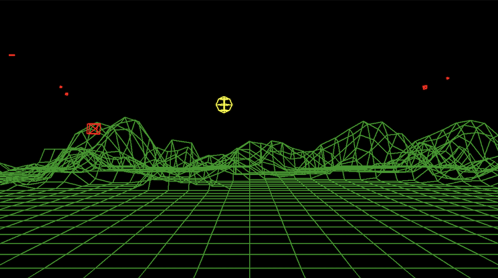
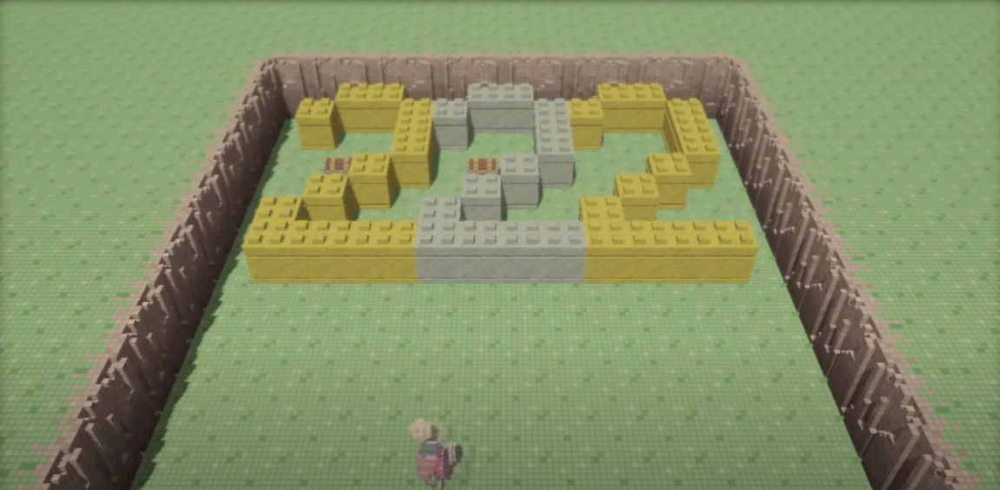

# Introdução à Matemática e Física Para Videojogos I / Fundamentos de Programação - Final Project

This is a very rudimentary, wireframe 3d engine.

This serves as a basis for the "Introdução à Matemática e Física Para Videojogos I" and Fundamentos de Programação course, on the [Licenciatura em Videojogos][lv] da
[Universidade Lusófona de Humanidades e Tecnologias][ULHT] in Lisbon.

The engine was built using:

* Python 3.8
* Pygame (https://www.pygame.org/news)

There is a set of sample applications that can be run by using:
`py.exe <sample_name>.py` or `python <sample_name>.py` or `python3.6 <sample_name>.py`, depending on your Python installation.

## Assignment

This assignment covers all the evaluation of both the Introdução à Matemática e Física para Videojogos I and Fundamentos de Programação, and is suitable only for the 3rd year students that still require the credits.

The assignment is to build a version of the game Breakout, using only the PyXYZ 1.1 engine.
The requirements are as follows:

* Viewpoint should be as the image below 
* Paddle should be controllable with both keyboard and mouse
* Multiple levels must be implemented, as well as title screen
* Circle/Box or Sphere/Box collision detection must be implemented.
* Hits on the paddle should not be physically accurate, but gameplay driven; although the paddle can be implemented as a box, a hit on the paddle shouldn't just reflect the ball, but take in account where the paddle the hits the ball, i.e. if the ball hits the top of the paddle but almost at the side, it should bounce back to where it came, instead of the physically correct reflection vector.
* Hits of the bricks should reflect using standard physics.

For extra credits, the following can be implemented:

* Implement filled geometry, replacing the wireframe
  * Hint: you'll have to sort objects by distance and draw back to front)
* Implement very simple point lighting:
  * Create a PointLight3d class and extend the Scene class so you're able to add light(s) to it
  * Implement shading based on the light:
    * Hint: Light intensity = max(0, dot(Face Normal, Incoming Light Direction))
    * Hint: Polygon Color = Light Intensity * Color

## Project delivery

* Project is individual
* Project has to be delivered up 20th January 2020 (midnight), and link delivered on the course's Moodle page
  * Deliverables have to include a link to the Github repo
    * If you want to use a private repository, instead of a public one, you can deliver all the files in a .zip file, __**INCLUDING**__ the .git directory for git usage analysis 
  * Project has to include a report, in a `readme.md` file. This report has to include the work done on the project, limitations, etc.
  * Report should also include (besides the names and numbers of students), their Github account username.
  * Report has to be formated in Markdown
* Grade will consider the following:
  * How much was achieved from the overal goals
  * Functionality and lack of bugs
  * Overall quality of code, including documentation
  * GIT usage throughout the project, as well as individual contributions of students
* Code will be verified with plagiarism detection tools, if any copy is detected, all students involved will have a zero.

## PyXYZ engine

The PyXYZ can be modified at will, full source code is available on this repo.

For more details on implementation and architecture of the engine, please refer to the sample applications and the PyXYZ.md file.

## Installation of required modules

To run the sample applications, you'll have to install all the used modules:

* `pip install pygame`

If pip is not available on the command line, you can try to invoke it through the module interface on Python:

* `python -m pip install <name of package>`

## Work on the project

We recomend building a fork of this project, and doing additional work on your repository.

* Create a copy (fork) of this repository (normally called _upstream_) in your Github account (**Fork** button in the upper right corner). The copy of the repository is usually called _origin_
* Get a local copy (on your PC) of the _origin_ repository, with the comand `git clone https://github.com/<your_username>/projecto_fp_mat_2020.git` (replace `<your username>` by your username in Github)
* Link the local repository with the remote _upstream_ repository with the command: `git remote add upstream https://VideojogosLusofona/projecto_fp_mat_2020.git`

Periodically, update your repository with changes done on the source `projecto_fp_mat_2020` repo (in case bug fixes are introduced):

* Make sure you're working on the _master_ branch:
  * `git checkout master`
* Download any updates on the projecto_fp_mat_2020 source repository by merging them with your _master_ branch:
  * `git fetch upstream`
  * `git merge upstream/master`
* Upload (_push_) the changes on _upstream_ to the _origin_ repository:
  * `git push origin master`

Do your normal work and commit/pull/push as taught. Grade will also take in account how well GIT is used throughout the project.

## Licenses

All code in this repo is made available through the [GPLv3] license.
The text and all the other files are made available through the 
[CC BY-NC-SA 4.0] license.

## Metadata

* Autor: [Diogo Andrade][]

[Diogo Andrade]:https://github.com/DiogoDeAndrade
[GPLv3]:https://www.gnu.org/licenses/gpl-3.0.en.html
[CC BY-NC-SA 4.0]:https://creativecommons.org/licenses/by-nc-sa/4.0/
[Bfxr]:https://www.bfxr.net/
[ULHT]:https://www.ulusofona.pt/
[lv]:https://www.ulusofona.pt/licenciatura/videojogos
