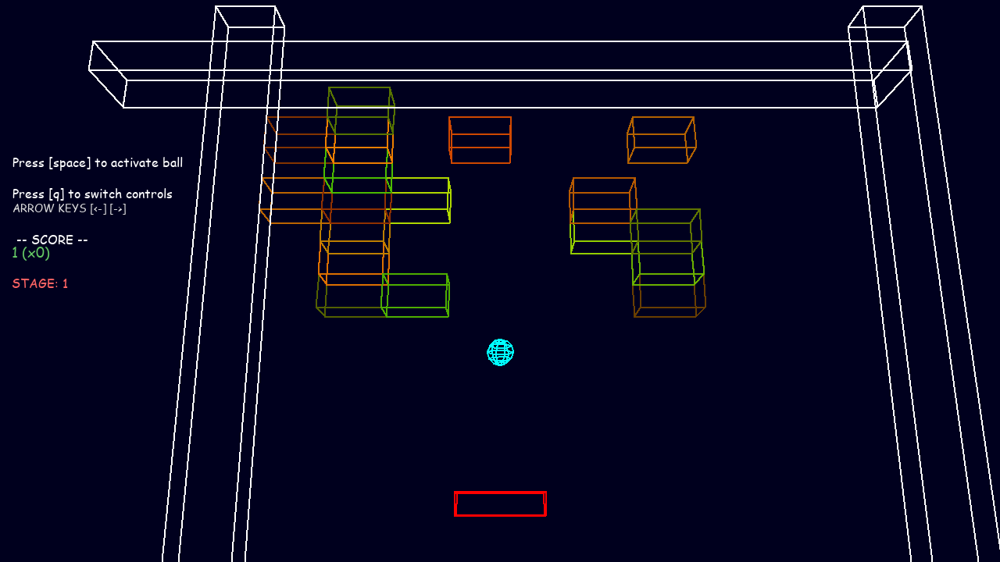

# Project Report - Final Project IMFJI/FP 2020-21

## Author

* Rafael Castro e Silva, nº 21903059
  * Github: [RafaelCS-Aula](https://github.com/RafaelCS-Aula)
  * Did everything, but did take some code from the samples.

----

## Project Overview

The project is a 3D _Breakout_ clone done using _pygame_ and the provided _PyXYZ_ engine, in accordance with the requirements in the [project briefing](Project_Instructions.md).

In order to play game, run the file `breakout_game.py`. At any time the game can be exited by pressing the `ESC` key. 

All modules made originally for the implementation of the game are named with the `breakout_` and `bo_` prefixes, this was done due to some issues with relative imports when trying to organize the files into sub-directories at the beginning of development. Besides original modules, the `Scene` module of the engine was also altered to accommodate the expansion in the functionality of its objects. 

Overall the game doesn't have major bugs, a minor one for example,is that the increasing speed of the ball tends to cause collision detection issues when it reaches very high speeds, assumingly due to _tunneling_. The goals of the project were overall met. None of the extra credits features were implemented.

## Methodology

For this project, most of the game and engine structure developed was based on the functionality of the `Unity Engine` and the `Godot Engine`, both of which the author was familiar with. These engines, more so `Unity`, were used as references on how to structure the needed expansions to the engine and the new classes that didn't immediately deal with gameplay logic. This made for an overall smooth development experience as most setbacks came from math errors and the author's inexperience with `Python`.
## Implemented Features

* Title and Game screens
  * Tilted camera perspective in game screen
* Infinite amount of stages
  * Brick placement is randomly generated every stage
  * Number of bricks increases with each passing stage
* 3D AABB and Sphere collision detection and handling
* Standard physical collision reaction when ball hits bricks
  * Paddle collisions generate a different bounce direction based on how far from the centre of the paddle the ball hit
  * Ball speed is increased with each collision
* Score counting
  * Every brick destroyed gives score
    * Every brick destroyed in between paddle touches increases a combo score bonus
  * Score given on each stage passed, increased with stage number
  * Dropping the ball removes score
* Paddle is controllable by mouse or keyboard
  * Input method can be altered during runtime by player
* Expanded `Scene` class:
  * Object destruction
  * Object state updating
  * Collision objects and collision updating
  * Text rendering objects updating

## References

* [3DCollisions Book](https://gdbooks.gitbooks.io/3dcollisions/content/)
* [PyGame docs](https://www.pygame.org/docs/)
* [StackOverflow](https://stackoverflow.com/)
* [Math Stack Exchange](https://math.stackexchange.com/)
* The sample applications